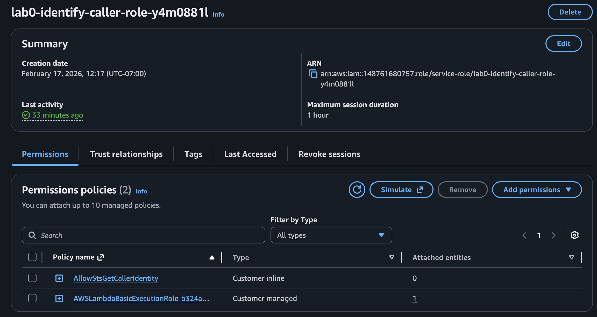
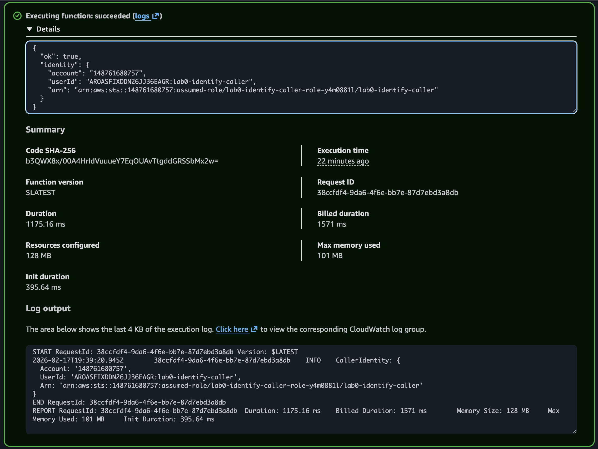
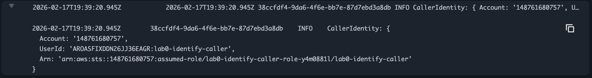

# Lab-00 | **~README~**
#DevAssociateLab

___

## Lab 00 — AWS SDK v3 + IAM Role Sanity

This warmup lab builds “credential instincts”: proving **who AWS thinks you are**, **where credentials are coming from**, and **why roles (temporary creds) beat long-lived access keys**. This becomes the baseline workflow you’ll reuse in every AWS lab and real project.

---

## What this lab demonstrates

### Engineering behaviors

- **Identity verification as a workflow:** Use `sts:GetCallerIdentity` as a repeatable “who am I?” check before creating resources.
- **Credential source awareness:** Confirm where credentials/region are resolved from (`AWS_PROFILE`, shared config, env vars).
- **Provider chain trap-proofing:** Demonstrate how env vars override profile creds and can cause “wrong identity / wrong account” issues.
- **Roles > keys (compute best practice):** Prove Lambda uses an **execution role** (temporary STS credentials) instead of local keys.
- **Evidence-driven debugging:** Use CloudWatch Logs and screenshots to document identity and execution context.

### Core AWS services / concepts

- **STS** (`GetCallerIdentity`) — identity thermometer
- **IAM** (users vs roles, trust vs permissions)
- **AWS SDK v3** (credential provider chain)
- **Lambda** (execution role identity)
- **CloudWatch Logs** (runtime proof)

---

## Why this matters in real apps

Most AWS “it doesn’t work” moments are actually **credential or permission problems**, not code problems:
- Wrong profile / wrong account
- Env vars overriding expected creds
- Services running under a role (Lambda/ECS/EC2) that doesn’t match local identity

If you can answer quickly:
1) **Who am I right now?**
2) **Where did creds come from?**
3) **What role is the service assuming?**

…you debug faster than 90% of people.

---

## Lab goal

Prove the end-to-end credential flow for AWS CLI + AWS SDK v3:
- Local CLI identity
- Local SDK identity (matches CLI when profile is consistent)
- Env var override behavior (safe failure)
- Lambda execution role identity (assumed-role ARN proof)

---

## What I built

- `src/identifyCaller.js` — minimal Node script using AWS SDK v3 that calls **STS `GetCallerIdentity`** and prints:
  - `Account`
  - `UserId`
  - `Arn`

This becomes a reusable “identity thermometer” for every future lab.

---

## Prerequisites

- AWS CLI configured with a profile named `lab-dev`
- Node.js installed + dependencies installed (`npm install`)
- **Never** store credentials in the repo (keys remain in `~/.aws/*`)

---

## Redaction rules (security hygiene)

✅ OK to show:
- AWS Account ID
- ARN
- Request IDs

❌ Never include:
- Access keys / secret keys
- Session tokens
- `.env` secrets
- `~/.aws/credentials` contents

---

## Screenshot Index

All screenshots live in: `docs/screenshots/`

**01) CLI identity baseline (STS GetCallerIdentity confirms the active principal for this terminal session)**  


**02) Credential source + region proof (aws configure list shows which files/inputs resolved access keys + region for the profile)**  


**03) SDK v3 identity sanity (Node + AWS SDK v3 resolves credentials via the provider chain and matches the CLI identity when using lab-dev)**  


**04) Env var override trap (Intentionally invalid env credentials demonstrate env vars override profile resolution and can cause InvalidClientTokenId)**  


**05) Lambda execution role proof (Lambda configuration shows the execution role used at runtime instead of local credentials)**  


**06) Lambda test output + logs show assumed-role ARN (Test invocation proves Lambda runs as an assumed-role identity via STS temporary credentials)**  


**07) CloudWatch log stream shows assumed-role ARN (CloudWatch Logs is the source-of-truth proof of the runtime identity)**  


---

## Quick run commands (repeatable)

### CLI identity check
```bash
AWS_PROFILE=lab-dev aws sts get-caller-identity
```

### Credential source check

```
AWS_PROFILE=lab-dev aws configure list
```

### SDK identity check (local)

```
AWS_PROFILE=lab-dev npm run dev
```

### Env var override test (safe failure)

> Uses intentionally invalid values. Never commit real secrets.

```
unset AWS_PROFILE AWS_DEFAULT_PROFILEexport AWS_ACCESS_KEY_ID="FAKEEXAMPLE"export AWS_SECRET_ACCESS_KEY="fake"export AWS_SESSION_TOKEN="fake"npm run dev
```

Cleanup:

```
unset AWS_ACCESS_KEY_ID AWS_SECRET_ACCESS_KEY AWS_SESSION_TOKEN
```

---

## Key takeaways

* I can prove AWS identity from CLI and code using **STS GetCallerIdentity**

* I understand the **credential provider chain** and how env vars can override profiles

* I can prove Lambda uses an **execution role** (assumed-role ARN) and temporary STS creds

* I can document and reproduce credential bugs safely without leaking secrets

___

## Exam cues (DVA-C02)

- **Credential provider chain precedence:** Environment variables (`AWS_ACCESS_KEY_ID`, `AWS_SECRET_ACCESS_KEY`, `AWS_SESSION_TOKEN`) can override profiles (`AWS_PROFILE`) and cause “wrong identity” or `InvalidClientTokenId`—always sanity check with `sts:GetCallerIdentity`.

- **Roles = STS temporary credentials:** AWS compute (Lambda/ECS/EC2) should use IAM roles; the runtime obtains **temporary STS creds** automatically. Temporary creds require a **session token**—missing `AWS_SESSION_TOKEN` is a common failure mode.

- **Assumed-role ARN proof:** When running in Lambda, `GetCallerIdentity` returns an `arn:aws:sts::...:assumed-role/...` ARN (not an IAM user ARN). If you still see a user ARN in a service context, you’re likely using local/static creds by mistake.