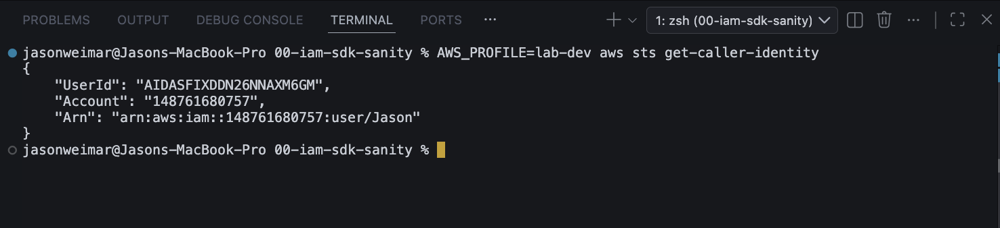
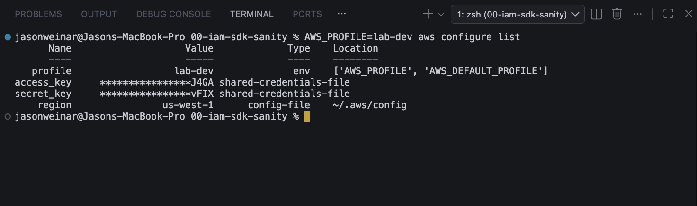
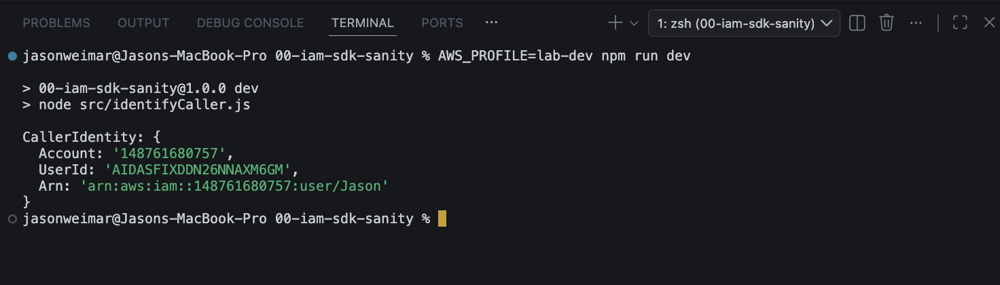
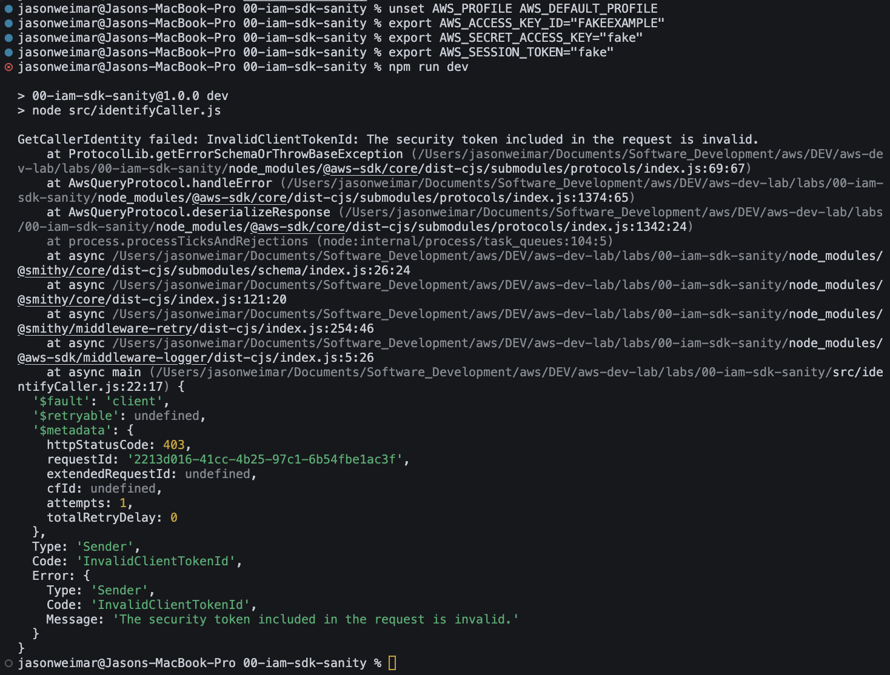

**First-Half of Lab-0:**

# Lab 0 — AWS SDK v3 + IAM Role Sanity

**Repo:** `aws-dva-dojo/labs/00-iam-sdk-sanity/`

## What this lab demonstrates (for employers + future-me)

This lab is a “credential sanity” foundation for AWS development.

By the end, I can confidently answer:

1. **Who am I authenticated as right now?**

2. **Where did those credentials come from (profile vs env vars vs role)?**

3. **How do I prove it inside code using AWS SDK v3?**

⠀
This is one of the most common real-world AWS debugging skills:

> *“I’m using the wrong credentials.”*

---

## Quick results (evidence)

* **CLI identity proof:** `aws sts get-caller-identity` confirms my AWS principal

* **Credential source proof:** `aws configure list` shows *where* creds + region are resolved from

* **SDK identity proof:** Node + AWS SDK v3 prints the same identity as the CLI (when using profile)

* **Provider chain trap proof:** intentionally invalid env creds cause expected auth failure (`InvalidClientTokenId`)

---

## Lab goal

Prove an understanding of how AWS credentials flow locally (**AWS_PROFILE vs environment variables**) and why **IAM roles + temporary credentials** are preferred for AWS services (Lambda/EC2/ECS) over long-lived access keys.

---

## What I built

**`src/identifyCaller.js`**
A minimal Node.js script using **AWS SDK v3** that calls **STS `GetCallerIdentity`** and prints:

* `Account`

* `UserId`

* `Arn`

This becomes a reusable “identity thermometer” for every future lab.

---

## Prerequisites

* AWS CLI configured with a profile named **`lab-dev`**

* Node.js + dependencies installed (`npm install`)

* Never store secrets in this repo (credentials stay in `~/.aws/*`)

---

# Lab walkthrough (stages)

## Stage 1 — CLI identity sanity (baseline)

### Goal

Confirm the terminal can call AWS and verify the active identity.

### Command

```
AWS_PROFILE=lab-dev aws sts get-caller-identity
```

### Expected output (example)

```
{
  "Account": "148761680757",
  "Arn": "arn:aws:iam::148761680757:user/Jason",
  "UserId": "..."
}
```

### Screenshot evidence

* `docs/screenshots/01-cli-getcalleridentity-profile.png`

---

## Stage 2 — Credential source + region proof (lab hygiene)

### Goal

Prove where the CLI is loading credentials + region from (profile, shared credentials file, config file).

### Command

```
AWS_PROFILE=lab-dev aws configure list
```

### What I’m looking for

* `profile` is `lab-dev`

* `access_key` / `secret_key` source is `shared-credentials-file`

* `region` source is `~/.aws/config`

### Screenshot evidence

* `docs/screenshots/02-cli-configure-list.png`

---

## Stage 3 — SDK v3 identity sanity (code matches CLI)

### Goal

Prove AWS SDK v3 uses the same credentials as the CLI when run under the same profile.

### Command

```
AWS_PROFILE=lab-dev npm run dev
```

### Expected output (example)

```
CallerIdentity: {
  Account: '148761680757',
  UserId: '...',
  Arn: 'arn:aws:iam::148761680757:user/Jason'
}
```

### Screenshot evidence

* `docs/screenshots/03-node-sdk-getcalleridentity.png`

---

## Stage 4 — Credential provider chain trap (env vars override / mislead)

### Goal

Demonstrate that environment variables can cause the SDK to authenticate using **different** credentials than expected (a common source of “wrong account / wrong permissions” bugs).

### Why this matters

The AWS CLI/SDK searches for credentials in a priority order. If conflicting sources exist (profile + env vars), behavior can become confusing.

### Commands (safe test using intentionally invalid env creds)

```
unset AWS_PROFILE AWS_DEFAULT_PROFILE

export AWS_ACCESS_KEY_ID="FAKEEXAMPLE"
export AWS_SECRET_ACCESS_KEY="fake"
export AWS_SESSION_TOKEN="fake"

npm run dev
```

### Expected output

```
InvalidClientTokenId: The security token included in the request is invalid.
```

### Cleanup

```
unset AWS_ACCESS_KEY_ID AWS_SECRET_ACCESS_KEY AWS_SESSION_TOKEN
```

### Screenshot evidence

* `docs/screenshots/04-envar-override-invalidtoken.png`

---

# Credential chain note (short + important)

### What `AWS_PROFILE=lab-dev` does

When I run:

```
AWS_PROFILE=lab-dev npm run dev
```

I’m setting an environment variable for that command that tells the AWS CLI/SDK:

> “Load credentials/config from the profile named `lab-dev`.”

Those settings live locally:

* `~/.aws/credentials` → access keys

* `~/.aws/config` → region/output defaults

They are **never stored in this repo**, which keeps the project safe and portable.

---

# Redaction rules (security hygiene)

✅ OK to show:

* AWS **Account ID**

* **ARN**

* Request IDs

❌ Never include:

* Access keys / secret keys

* Session tokens

* `.env` secrets

* `~/.aws/credentials` contents

---

# Screenshots index

All screenshots live in: `docs/screenshots/`

### 1) CLI identity baseline


### 2) Credential source + region proof


### 3) SDK v3 identity sanity


### 4) Env var override trap


*(Future stage: Lambda role proof will add CloudWatch Logs + Lambda execution role screenshots.)*

---

# Key takeaways (what this lab proves)

* I can verify AWS identity from CLI using **STS `GetCallerIdentity`**

* I can verify AWS identity from code using **AWS SDK v3**

* I understand that **credential source precedence** can cause “wrong identity” bugs

* I can intentionally reproduce and resolve those issues (clean environment → predictable results)