# Lab-01 | **README**
#DevAssociateLab
___
# Lab 01 — SQS → Lambda Worker (Retries, DLQ, Partial Batch Failures)

This lab implements a reliable async worker pattern using SQS + Lambda:
- messages are processed in batches
- failures retry safely
- poison messages get isolated into a DLQ
- partial batch failures prevent “good messages” from being reprocessed

If you’re a hiring manager skimming: this repo is designed to prove I can build and validate an event-driven worker the same way it’s done in production (config correctness + IAM least privilege + runtime proof).

---
## What this demonstrates

**Engineering behaviors**
- Asynchronous processing and decoupling (queue buffer)
- Failure isolation (DLQ + maxReceiveCount)
- Correct retry semantics (visibility timeout, redelivery)
- Partial batch failure handling (ReportBatchItemFailures)
- Least privilege IAM (queue ARN scoping)
- Validation via logs + evidence screenshots

**Core AWS services**
- SQS (source queue + DLQ)
- Lambda (worker)
- IAM (trust + permissions)
- CloudWatch Logs (observability)

---
# Exam cues / gotchas this lab covers
* SQS is at-least-once → duplicates are possible; retries are normal.
* Visibility timeout must be sized to avoid concurrent duplicate processing.
* DLQ redrive policy uses maxReceiveCount + DLQ ARN.
* Without partial batch failures, one poison message can cause whole-batch reprocessing.
* IAM must be scoped (queue ARN) and separated into trust vs permissions.

___
# Interview talking points
* “I used SQS to buffer work and Lambda to auto-scale consumption.”
* “I configured a DLQ so poison messages don’t block throughput.”
* “I enabled partial batch failures so only failed items retry.”
* “IAM is least privilege: SQS actions scoped to the queue ARN + CloudWatch logs.”
* “I validated behavior with CloudWatch logs and DLQ evidence.”

___

Architecture (mental model)

Producer ---> [SQS Source Queue] ---> (Lambda polls in batches) ---> [Lambda Worker]
                        |
                        | after maxReceiveCount failures
                        v
                      [DLQ]
___

## Screenshot Index
All screenshots live in: docs/screenshots/

**1a) SQS DLQ configuration**

**1b) SQS redrive policy with DLQ association**

**2) IAM role permissions**

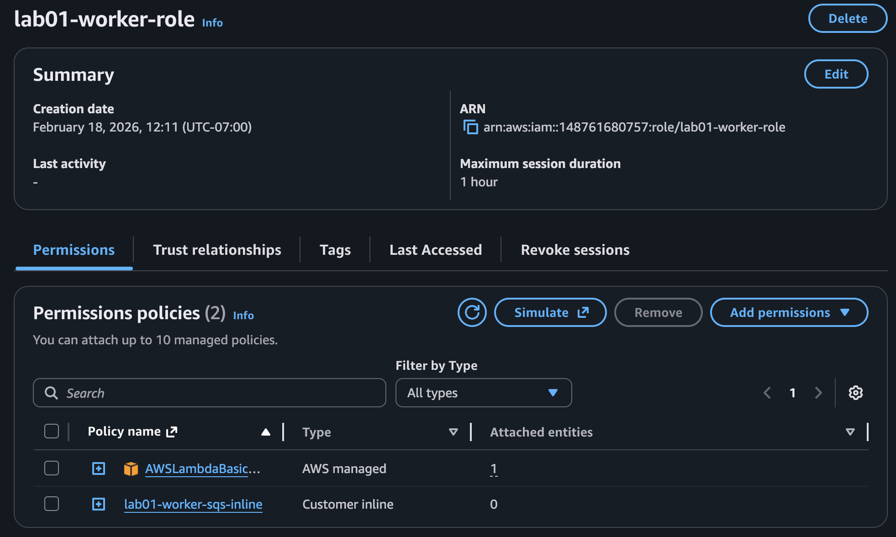

**3) IAM inline policy scoped to queue ARN**

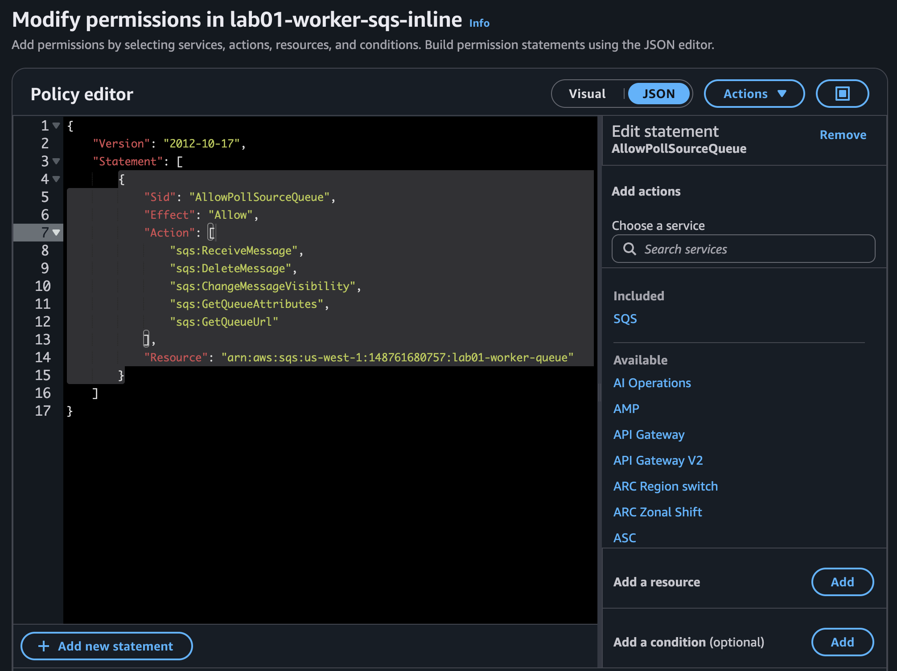

**4) IAM trust policy (Lambda assumes role)**

**5) Lambda overview**

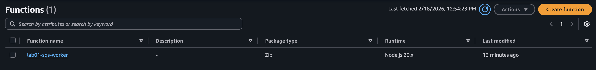

**6) Lambda overview details**

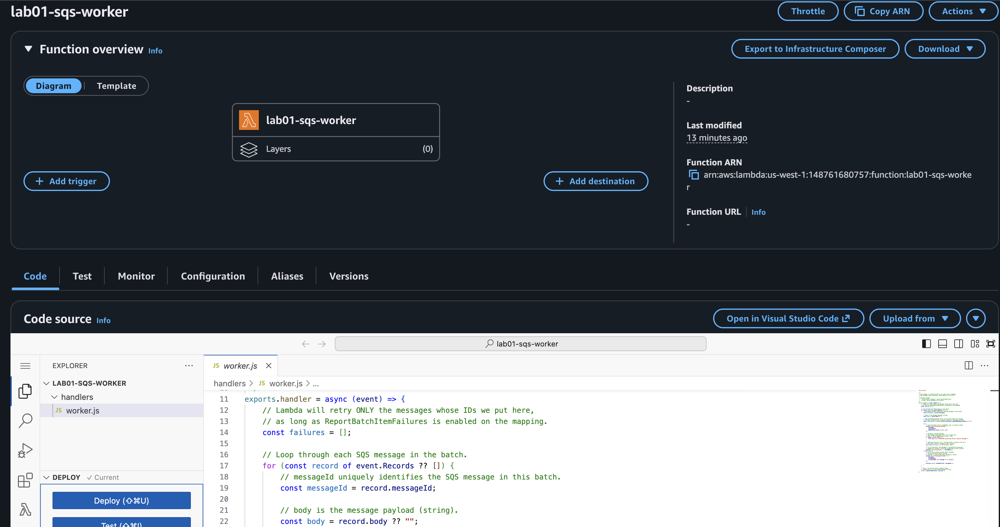

**7) Lambda runtime + handler configuration**

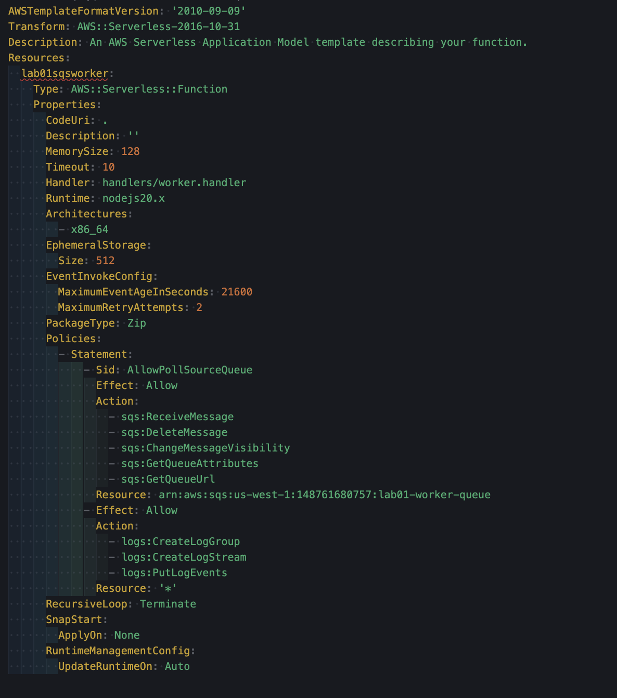

**8a) Lambda execution role permissions for CloudWatch**

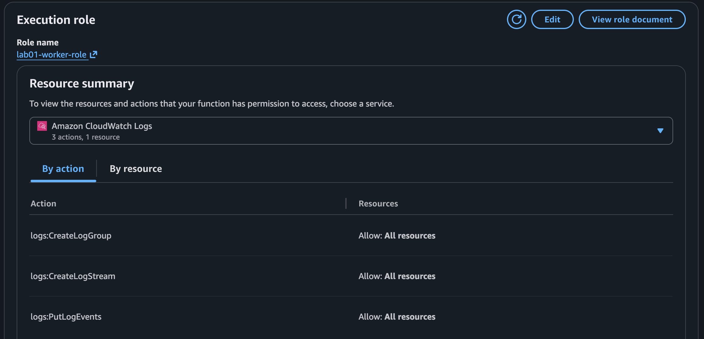

**8b) Lambda execution role permissions for SQS**

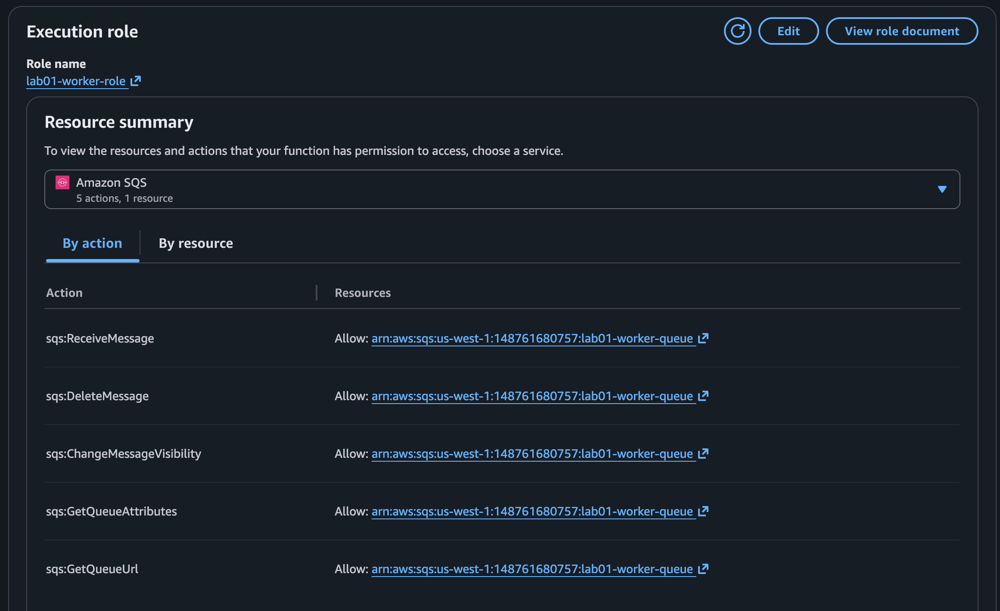

**9) Lambda worker code**

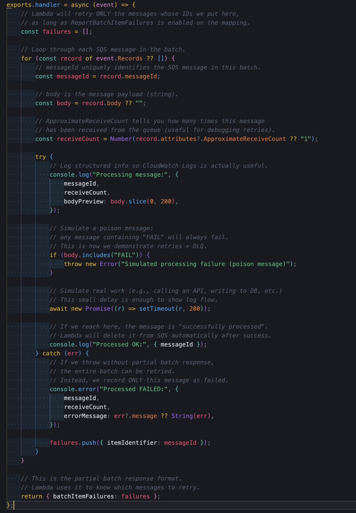

**10a) Lambda SQS trigger configuration**

**10b) CLI event source mapping proof**

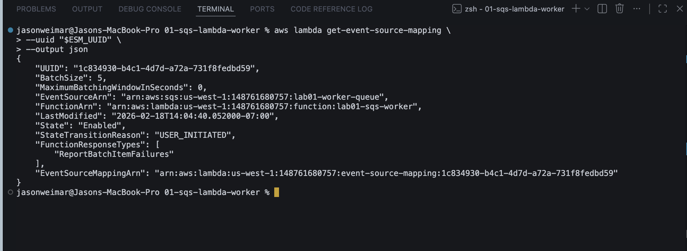

**11) CloudWatch logs showing OK + fail + retry**

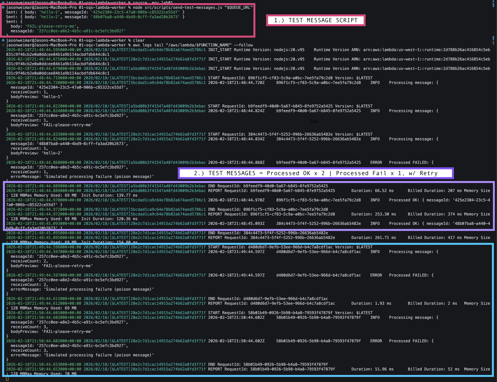

**12) DLQ message body (poison message)**

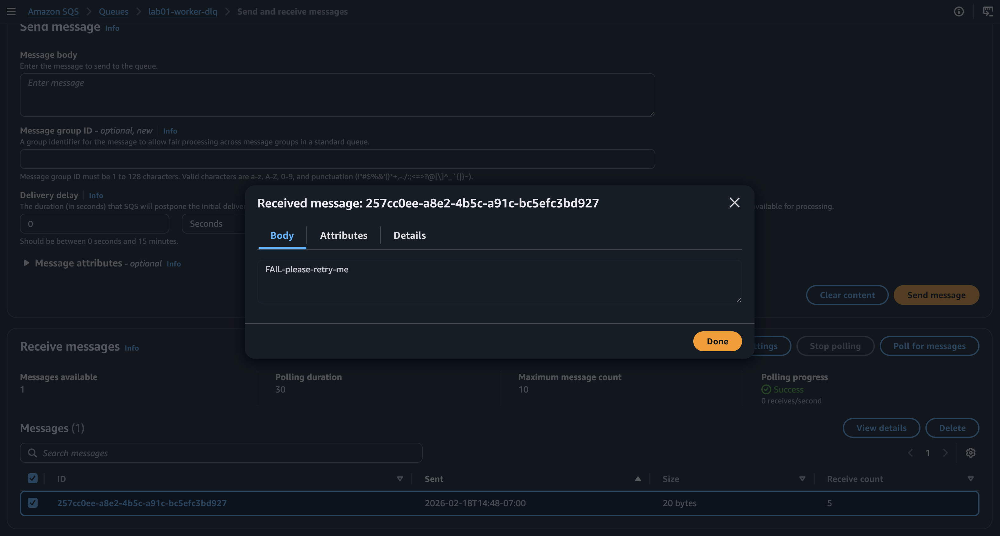
