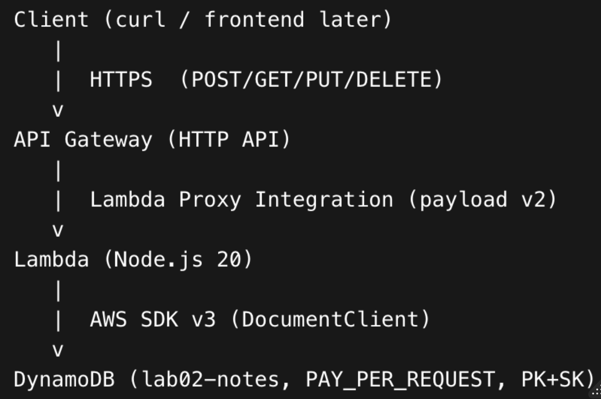

Lab 02 — Notes API (API Gateway HTTP API + Lambda + DynamoDB)

A serverless CRUD backend that exposes a small Notes API through **API Gateway (HTTP API)**, runs business logic in **AWS Lambda (Node.js 20)**, and persists data in **DynamoDB** using a simple **PK/SK single-table pattern** with safe conditional writes.

---

## What this lab demonstrates

### Engineering behaviors

- **Serverless API composition:** API Gateway routes HTTP requests to Lambda (proxy integration) with clear request/response contracts.
- **Resource-oriented CRUD design:** Standard endpoints (`POST/GET/PUT/DELETE`) with correct status codes (`201/200/204/404`) and basic validation.
- **DynamoDB-first data modeling:** PK/SK single-table pattern designed around access patterns (Query for list, GetItem for fetch-by-id).
- **Safe writes / correctness controls:** Conditional expressions (`attribute_not_exists`, `attribute_exists`) prevent accidental overwrites and enable clean 404 behavior on update/delete.
- **Least privilege IAM:** Execution role scoped to the DynamoDB table ARN (and index ARN) plus CloudWatch Logs permissions.
- **Operational verification:** Evidence-driven workflow—CLI/console proofs + CloudWatch logs + end-to-end curl tests + DynamoDB item proof screenshots.
- **Debug-to-root-cause workflow:** CloudWatch logs used to diagnose runtime issues (module format, promise handling) and validate fixes.

### Core AWS services

- **API Gateway (HTTP API):** Public HTTPS endpoint + route mapping to Lambda integration (payload v2.0).
- **Lambda:** Node.js 20 runtime, single handler implementing CRUD routing and DynamoDB calls.
- **DynamoDB:** On-demand table with composite key (`PK`, `SK`) supporting Query-based list and key-based item operations.
- **IAM:** Trust policy + scoped permissions policy (table ARN) + managed basic execution policy for logs.
- **CloudWatch Logs:** Runtime observability and troubleshooting source of truth.

### Why this matters in real apps

This pattern is the backbone of a ton of real web products: a clean HTTP API front door, stateless compute for business logic, and a managed data store behind it. Replace “notes” with almost any domain object and you have a production-ready starting point.

Common real-world use cases:
- **Admin dashboards / internal tools:** CRUD for customers, inventory, appointments, tickets, or content.
- **SaaS MVP backends:** Quickly ship reliable endpoints without managing servers.
- **Event capture + audit trails:** Store lightweight records (feedback, logs, submissions) with predictable read patterns.
- **Mobile + web clients:** Multiple frontends can hit the same API contract (React, iOS, Android).

Key advantages demonstrated here:
- **Scales automatically:** API Gateway + Lambda + DynamoDB handle spiky traffic without manual scaling.
- **Cost-efficient:** Pay-per-request components are ideal for small apps and variable usage.
- **Safer data writes:** Conditional expressions protect against overwrites and enforce “exists/doesn’t exist” semantics.
- **Security posture is clear:** Least-privilege IAM and scoped resources reduce blast radius.
- **Easy to debug:** CloudWatch logs show exactly what executed when something fails.

## Architecture (at a glance)

**Flow:** Client → API Gateway (HTTP API) → Lambda → DynamoDB



---

## API Endpoints

| Method | Path | Purpose | Expected Status |
|---|---|---|---|
| POST | `/notes` | Create a note | 201 |
| GET | `/notes` | List notes | 200 |
| GET | `/notes/{noteId}` | Get a note by id | 200 / 404 |
| PUT | `/notes/{noteId}` | Update note fields | 200 / 404 |
| DELETE | `/notes/{noteId}` | Delete a note | 204 / 404 |

---

## Data model (DynamoDB)

Single-table pattern:

- `PK = "NOTE"`
- `SK = "NOTE#<noteId>"`

**Why this works well:**
- List notes is a fast **Query**: `PK = NOTE` + `begins_with(SK, "NOTE#")`
- Get/update/delete uses the full key: `PK = NOTE`, `SK = NOTE#<noteId>`

---

## Repo structure

Repo structure

```text
02-notes-api/
  src/
    handlers/
      api.js
    lib/
      ddb.js
  infra/
    lambda-trust.json
    lambda-ddb-policy.json
  docs/
    architecture/
      architecture-at-a-glance.png
    screenshots/
      (see Screenshot Index below)
  package.json
```

Screenshot Index

All screenshots live in: docs/screenshots/

**01) DynamoDB Table Overview (Table created with PK/SK schema and On-Demand billing mode for serverless scaling)**
**02) Lambda Handler Routing (Single handler reads HTTP method/path and routes requests to the correct CRUD branch)**


**03) Lambda Endpoint Routing (CRUD endpoints implemented in one Lambda with correct status codes and route fallback behavior)**


**04) DynamoDB Persistence Pattern (PK/SK model + conditional writes + Query pattern for fast reads without scans)**


**05) DynamoDB Client Wrapper (Centralized DynamoDB DocumentClient setup for reuse and safer marshalling behavior)**


**06) Lambda Config Proof - CLI (CLI verification of runtime, handler, role, and TABLE_NAME environment variable)**


**07) IAM Role Permissions (Execution role includes CloudWatch logging and DynamoDB permissions scoped to the table ARN)**


**08) Lambda Overview (Lambda function deployed and ready to be invoked by API Gateway)**


**09) Lambda Config - Env/Runtime/Handler (Runtime + handler wiring confirmed and TABLE_NAME environment variable set)**


**10) API Gateway Routes - CLI (CLI proof that HTTP routes exist and map to the Lambda integration)**


**11) API Gateway Routes (HTTP API routes configured for Notes CRUD endpoints)**


**12) API Gateway Integration (Lambda proxy integration configured using payload format v2.0)**


**13) API Gateway Stage - $default (Auto-deployed default stage used to serve the live API endpoint)**


**14) Create Note - 201 (End-to-end create: API Gateway → Lambda → DynamoDB returns 201 + created note JSON)**


**15) Get Note (Get-by-id returns the persisted item using PK/SK key lookup)**


**16) List Notes (Query-based list returns items under PK=NOTE without scanning the table)**


**17) Update Note (Update uses conditional expressions to ensure item exists and returns updated attributes)**


**18) DynamoDB Item Proof (Console proof of PK/SK + attributes after create/update)**


**19) CloudWatch Logs Invocations (Runtime proof of Lambda invocation lifecycle during API requests)**


**20) Delete Note - 204 (Delete endpoint returns 204 No Content on successful delete)**


**21) Get After Delete - 404 (After delete, Get-by-id returns 404 Not Found)**

## Exam cues (DVA-C02)

* **API Gateway (HTTP API)** uses Lambda proxy integration; event shape is HTTP API v2 (`requestContext.http.method/path`)

* **Lambda invoke permission for API Gateway** is a *resource-based policy* on the Lambda function (`lambda add-permission`)

* DynamoDB modeling emphasizes:

  * **Query vs Scan**

  * PK/SK access patterns

  * **Conditional expressions** for safe writes

* IAM best practices:

  * Separate **trust policy** (who assumes role) vs **permissions policy** (what the role can do)

  * Scope resources to the table ARN instead of `*`

---

## Cleanup (avoid ongoing costs/clutter)

> DynamoDB on-demand and Lambda cost is typically tiny for labs, but cleanup keeps your console tidy.

* Delete API Gateway HTTP API

* Delete Lambda function

* Delete IAM role + inline policy

* Delete DynamoDB table

* (Optional) delete CloudWatch log group: `/aws/lambda/lab02-notes-api`

---

## Next upgrades

* Add a small frontend (React/Vite) to create a Notes UI (CORS + env var for API URL)

* Add auth (Cognito) as a later “security overlay” lab

* Add structured logging (method/path/noteId) and CloudWatch metrics/alarms