# Lab-03 | README
#DevAssociateLab
___
# Lab 03 — Portfolio Shell (S3 + CloudFront + Route 53 + ACM)

A TypeScript (Vite + React) portfolio shell deployed to a **private S3 origin** served through **CloudFront (HTTPS)** with an optional **custom domain** via **Route 53 + ACM (us-east-1)**.

## What this Lab demonstrates

**Engineering behaviors**

* Secure static hosting pattern: **private S3 origin** served only through CloudFront (no public bucket)

* Repeatable deploy workflow: **build → sync → invalidate** (artifact-driven releases)

* Cache awareness + correctness: understanding **Hit/Miss**, TTL behavior, and invalidations

* SPA deep-link reliability: CloudFront error responses (**403/404 → `/index.html`→ 200**) so refreshes don’t break routes

* Domain + TLS hygiene: SNI-based HTTPS with ACM and correct hostname coverage (root + `www`)

* Evidence-first verification: curl headers (`via`, `x-cache`, `x-amz-cf-*`) + console screenshots to prove behavior

* Cost-control mindset: “hibernate” strategy by disabling/deleting the public entry (CloudFront) while keeping artifacts

**Core AWS services**

* S3 (private origin bucket for static assets)

* CloudFront (CDN, HTTPS, caching, origin access control)

* ACM (public TLS certificate — CloudFront requires **us-east-1**)

* Route 53 (DNS routing for apex + `www` to CloudFront)


## Architecture (at a glance)
**Flow:** Browser → CloudFront → S3 (private origin)

```text
Browser
  └── HTTPS
      └── CloudFront (CDN)
            └── Origin Access Control (OAC)
                  └── S3 Bucket (private)
```

## Repo structure

```text
03-portfolio-shell/
  src/
  infra/
  scripts/
  docs/screenshots/
  package.json
```

## Deploy (one command)

```bash
npm run deploy
```

___
## Interview talking points

* **Production-style static hosting:** “I deployed a React + TypeScript portfolio shell to a private S3 origin served through CloudFront, so the bucket is not publicly readable and CloudFront is the only public entrypoint.”

* **Security posture:** “I enforced S3 Block Public Access and relied on a resource-based bucket policy to allow CloudFront origin access—no public S3 website hosting.”

* **TLS + custom domain:** “I attached a custom domain using Route 53 + ACM, and handled the CloudFront-specific requirement that viewer certs must live in us-east-1.”

* **Operational repeatability:** “I built a one-command deploy workflow: build → sync to S3 → CloudFront invalidation, and validated changes with cache headers.”

* **Evidence-first debugging:** “When something didn’t work, I used curl headers (`x-cache`, `via`, `x-amz-cf-*`) to prove whether the request was CloudFront vs origin, and isolated DNS vs cert vs cache issues.”

* **SPA correctness:** “I configured CloudFront error responses to support SPA deep linking so routes don’t break on refresh.”

* **Portfolio framing:** “This site is the stable front door for future labs—APIs and backend services will plug into this shell while the delivery layer stays consistent.”
___

## Screenshot Index

All screenshots live in: `docs/screenshots/`

**01) CLI identity baseline (profile + caller identity)**
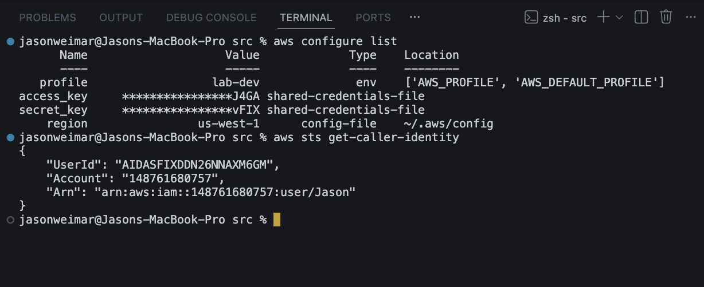

**02) Vite TS app running locally (proof of TS baseline)**
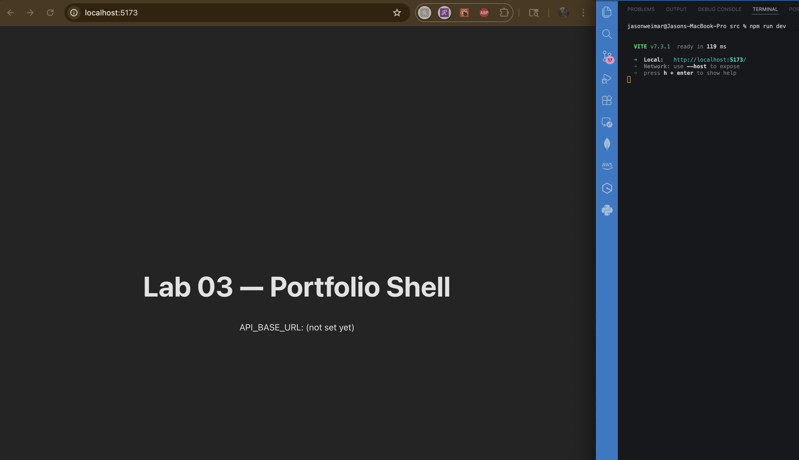

**03) S3 bucket created (origin bucket created)**
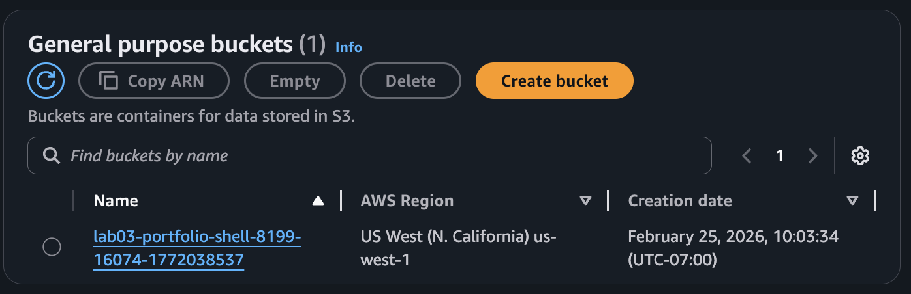

**04) S3 public access block enabled (bucket is not public)**
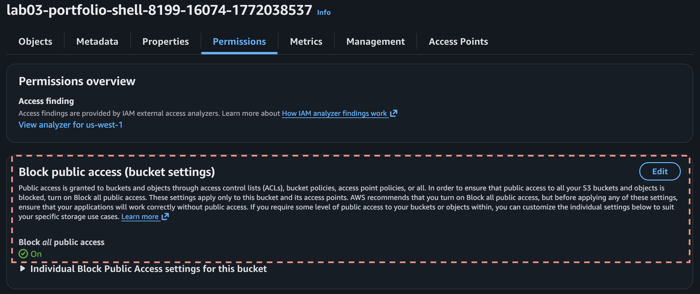

**05) CloudFront distribution overview (domain name visible)**
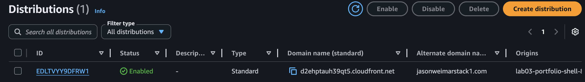

**06) Origin Access Control configured (OAC proof)**
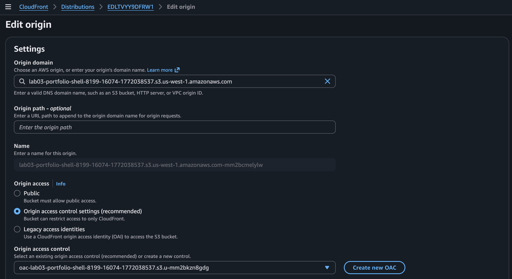

**07) S3 bucket policy allowing CloudFront access (resource policy proof)**
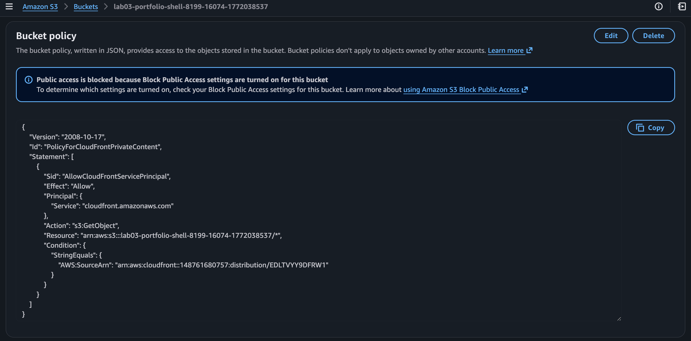

**08) Deployed site loads via CloudFront HTTPS (browser proof)**
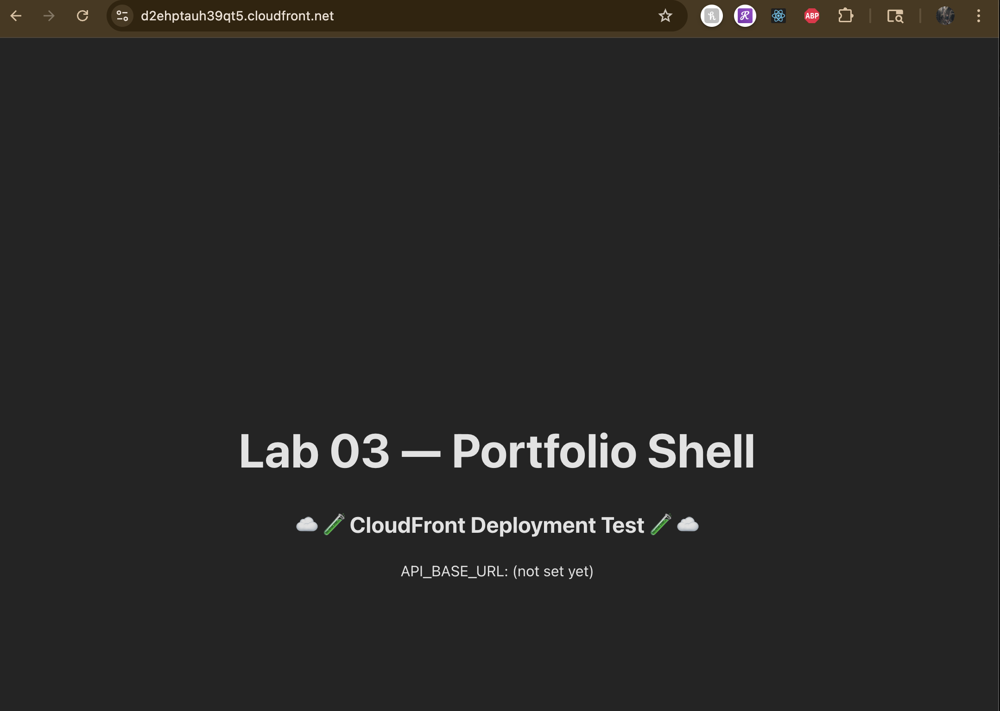

**09) CloudFront invalidation created (cache bust proof)**
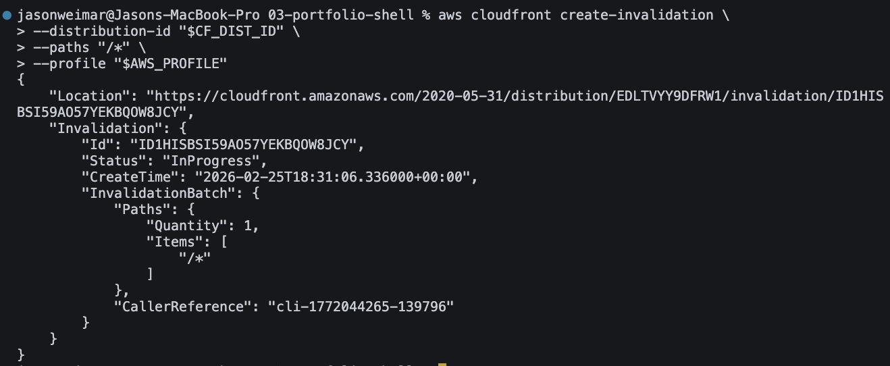

**10) Post-invalidation content change visible (deploy loop proof)**
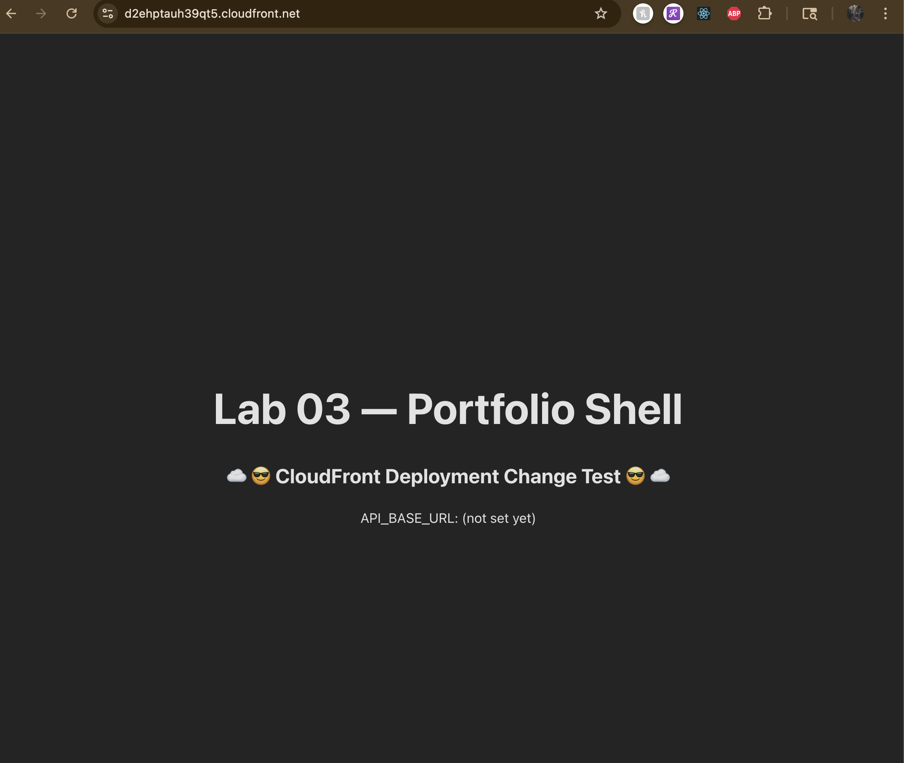

**11) ACM cert issued in us-east-1 (CloudFront requirement)**
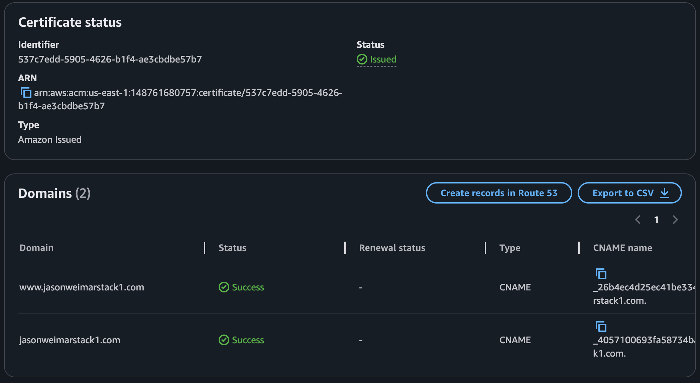

**12) Route 53 records route root + www to CloudFront**
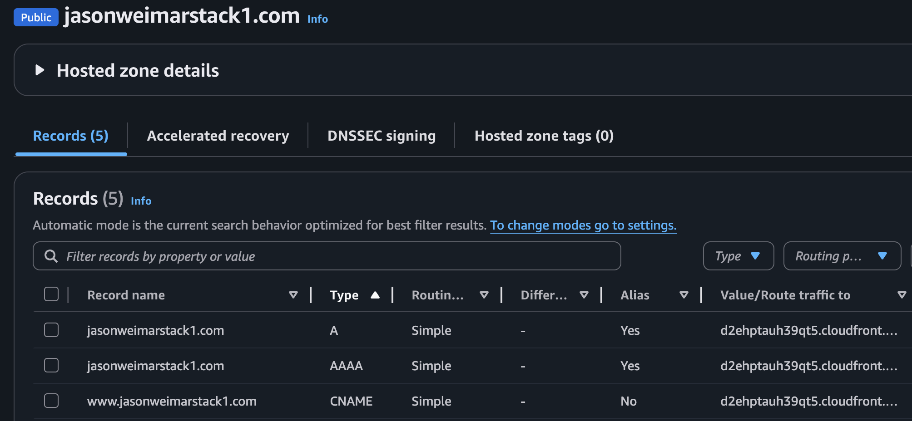


___
## Exam cues (DVA-C02)

* **CloudFront ↔ S3 private origin pattern:** Keep the S3 bucket private and let CloudFront be the public entrypoint. S3 access is controlled by a **bucket policy (resource-based policy)**, not by making the bucket public.

* **OAC/OAI concept check:** Know the purpose of origin access controls (CloudFront can read the bucket; the public can’t). On the exam you’ll see “how do we prevent direct S3 access but still serve content?”

* **ACM region trap (CloudFront):** CloudFront viewer certificates must come from **ACM in `us-east-1`**. If the cert is in another region, it won’t attach for a custom domain.

* **Aliases + TLS handshake failure:** A custom hostname (like `www.domain.com`) must exist in **CloudFront Alternate Domain Names** *and* be covered by the ACM cert SANs (or wildcard), or you’ll get TLS/cert mismatch behavior.

* **Route 53 Alias vs CNAME:** Use **Alias A/AAAA** for apex/root records; CNAME is fine for subdomains but apex CNAME is not standard. Alias is AWS-native and preferred.

* **Caching behavior + invalidation:** CloudFront caches. If updates don’t appear immediately, validate whether it’s browser cache vs CloudFront cache vs TTL. Use invalidations to force a refresh (and understand the tradeoffs).

* **SPA deep-link fix:** For React/Vite SPAs, configure CloudFront error responses (403/404 → `/index.html` → 200) to prevent refresh/deep-link failures.

* **Troubleshooting via headers:** `via: ...cloudfront.net` and `x-amz-cf-*` prove CloudFront served the request; `x-cache` tells you Hit/Miss.

___
## Cleanup / Hibernate (cost control)

* Disable/delete CloudFront distribution to “turn off” public entry

* Optionally delete S3 bucket objects/bucket

* ACM cert is free; Route 53 hosted zone costs monthly if kept