# Lab-04 | **README**

___
# Lab 04 — S3 → Lambda → DynamoDB (Image Metadata Pipeline)

## Overview

This lab builds an **event-driven serverless ingestion pipeline**: when an image is uploaded to S3, an S3 **ObjectCreated** event triggers a **TypeScript Lambda** that fetches object metadata via **HeadObject** (authorized by `s3:GetObject`) and writes a normalized record to **DynamoDB** using a **conditional write** for idempotency. **CloudWatch Logs** provide evidence and debugging telemetry.

---

## Architecture

**Flow:** Upload → S3 → (ObjectCreated event) → Lambda (TS) → DynamoDB

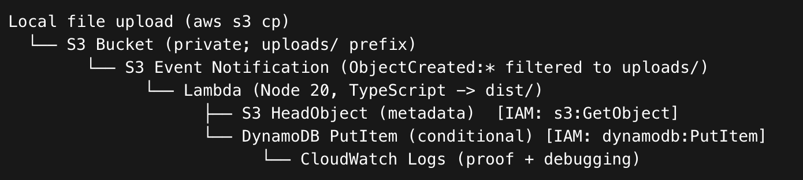

---

## Services used

* **Amazon S3** — object storage + event source

* **AWS Lambda** — serverless compute (Node.js 20, TypeScript build artifact)

* **Amazon DynamoDB** — metadata storage (on-demand)

* **AWS IAM** — trust policy + least-privilege permissions + Lambda resource policy

* **Amazon CloudWatch Logs** — observability / evidence

---

## What this demonstrates

**Engineering behaviors**

* Event-driven architecture (upload → event → compute → persistence)

* Asynchronous execution + **at-least-once delivery** safety (design for duplicates/retries)

* **Idempotency** via DynamoDB conditional writes (duplicate events don’t duplicate records)

* Deterministic key design (stable PK from bucket+key; SK from ETag for version/history)

* Least privilege IAM (scoped table ARN + bucket objects ARN)

* Evidence-first validation (CLI proof + CloudWatch logs + DynamoDB proof screenshots)

* Operational debugging flow (verify event → logs → data)

**Core AWS services**

* S3 (ObjectCreated event source + durable storage)

* Lambda (ingestion worker)

* DynamoDB (metadata table)

* IAM (execution role + resource-based invoke policy)

* CloudWatch Logs (observability)

---

## DynamoDB data model (single-table pattern)

We store one item per object version (ETag):

* **PK:** `IMG#<bucket>#<key>`

* **SK:** `META#<etag>`

**Why this works**

* Same object path → stable PK

* New content/version → new ETag → new SK (history-friendly)

* Duplicate event/retry → same PK+SK → rejected by conditional write (idempotency)

---

## Business logic (Lambda)

For each S3 event record:

1. Decode `object.key` (URL-encoded in events)

2. Call `HeadObject` to read metadata (no file download)

3. Write normalized metadata record to DynamoDB using:

   * `ConditionExpression: attribute_not_exists(PK) AND attribute_not_exists(SK)`

⠀
---

## IAM (security posture)

**Execution role (identity-based policy)**

* `dynamodb:PutItem` scoped to the table ARN

* `s3:GetObject` scoped to `arn:aws:s3:::<bucket>/*` *(authorizes HeadObject)*

* CloudWatch Logs write permissions

**Invoke permission (resource-based policy on Lambda)**

* S3 is allowed to invoke the function via `aws lambda add-permission`

* Scoped by `SourceArn` to the specific bucket (and optionally `SourceAccount`)

**Exam trap reinforced**
Invoker permissions live on the **Lambda resource policy**, not the Lambda execution role.

---

## Repo structure

```
04-image-metadata-pipeline/
  dist/  
  src/
      handlers/    
      lib/
  infra/  
  scripts/  
  docs/
      images/    
      screenshots/
  package.json  
  tsconfig.json

```

---

## Build + deploy (CLI-first pattern)

### Build (TypeScript → dist/)

```
npm run cleannpm run build
```

### Package (zip dist + node_modules)

```
zip -r /tmp/lab04-lambda.zip dist node_modules package.json
```

### Create/update Lambda (example)

```
aws lambda create-function ...        # first time
aws lambda update-function-code ...   # updates

```

---

## Screenshot Index

All screenshots live in: `docs/screenshots/`

**01) CLI identity baseline (profile + caller identity)**

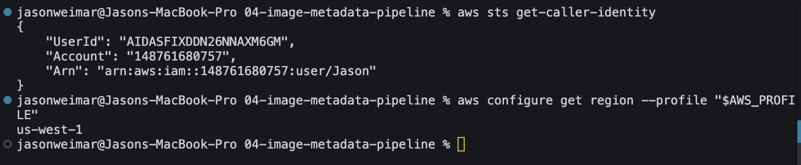

**02) TypeScript build baseline (dist/ artifact proves TS → JS pipeline)**

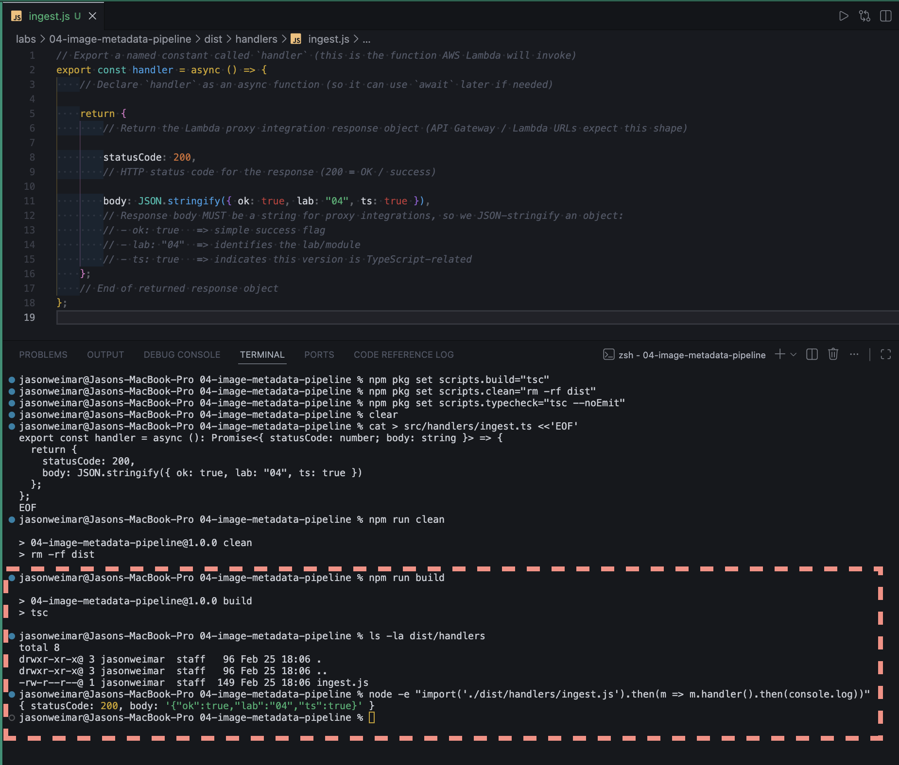

**03) DynamoDB table created (PK/SK + on-demand billing)**

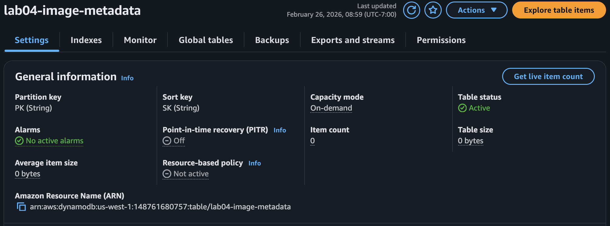

**04) S3 bucket created (uploads bucket exists)**

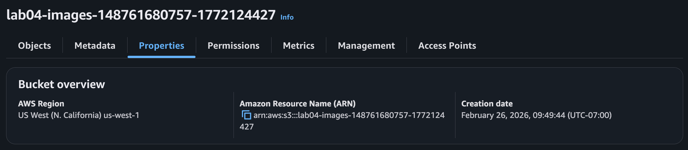

**05) S3 Block Public Access enabled (bucket is private)**

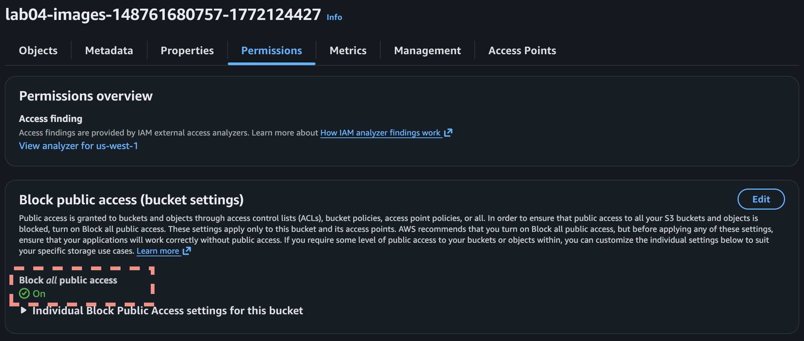

**05b) S3 default encryption enabled (SSE-S3 / AES256)**

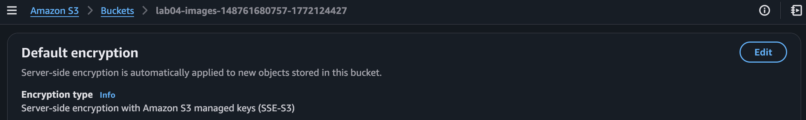


**06) Lambda runtime + handler (proof of correct entrypoint)**


**06b) Lambda execution role (role attached to function)**

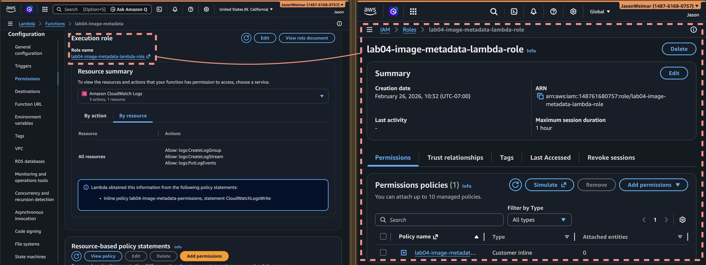

**07) IAM policy scoping (DDB PutItem + S3 GetObject + logs)**

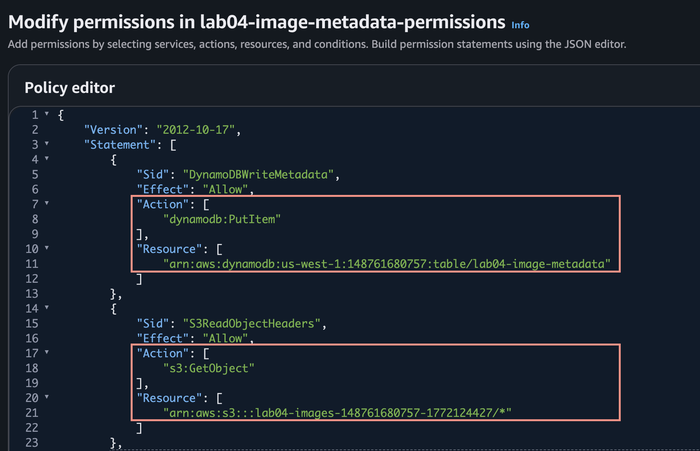

**08) CloudWatch logs proof (Lambda processed S3 event + wrote PK/SK)**

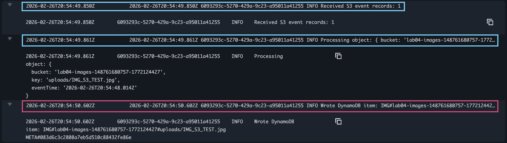

**09) S3 event notification configured (ObjectCreated filtered to uploads/)**

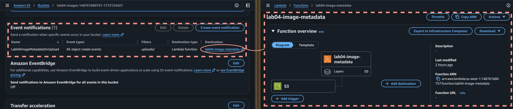

**10) Lambda resource-based policy allows S3 invoke (add-permission proof)**

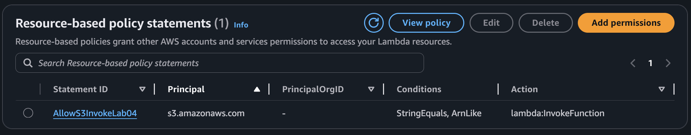

**11) Upload test image (CLI proof of event creation)**

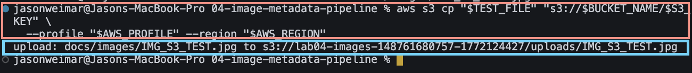

**12) CloudWatch log stream proof (bucket/key processed)**

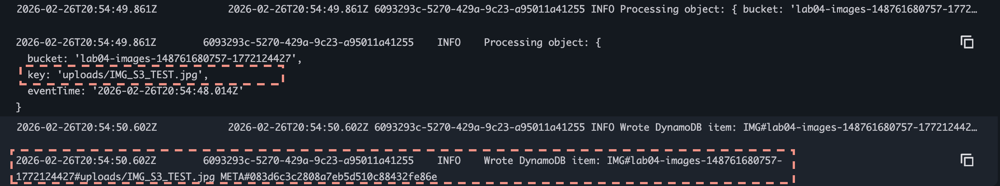

**13) DynamoDB item proof (get-item shows stored metadata)**

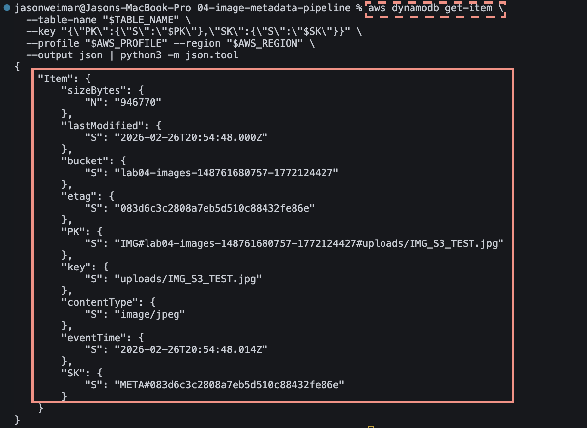

**14) Idempotency proof (duplicate upload safely rejected via conditional write)**

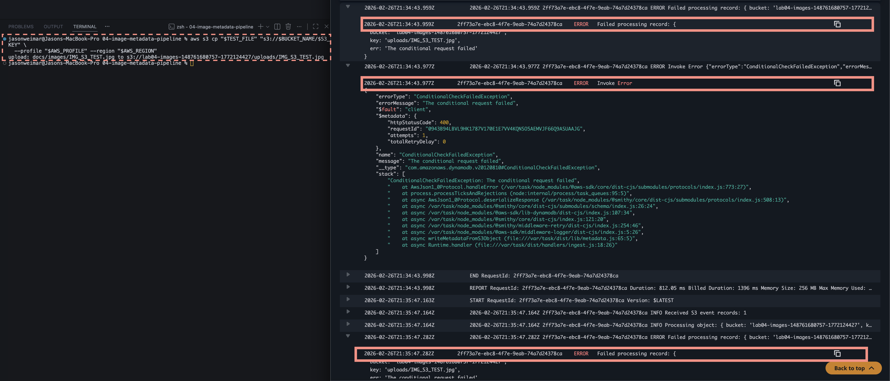

---

## Exam cues (DVA-C02)

* **At-least-once events:** S3 → Lambda can duplicate/retry; design **idempotent writes**

* **Conditional writes:** `attribute_not_exists` is a common dedupe pattern

* **IAM action naming trap:** `HeadObject` is authorized by **`s3:GetObject`**

* **Invoker vs execution permissions:** S3 invoke is Lambda **resource policy**, not the execution role

* **Event record parsing:** S3 keys are URL-encoded; decode keys to avoid “NoSuchKey”

* **CloudWatch-first debugging:** confirm invoke → inspect logs → validate data in DynamoDB

---

## Interview talking points

* “I built an event-driven serverless ingestion pipeline using S3 events to trigger Lambda.”

* “The Lambda enriches uploads using HeadObject (metadata-only) and persists records in DynamoDB.”

* “I designed for retries and duplicates using deterministic keys + conditional writes for idempotency.”

* “I implemented least-privilege IAM and demonstrated the difference between execution role and resource-based invoke policies.”

* “I validated behavior with evidence screenshots: upload proof, logs proof, and DynamoDB proof.”

---

## Cleanup / Hibernate (cost control)

* **S3:** delete objects then delete bucket (or keep for later)

* **DynamoDB:** delete table (easy recreate)

* **Lambda + IAM:** keep if you want reuse, or delete to fully clean

* **CloudWatch Log Group:** optional (tiny cost)