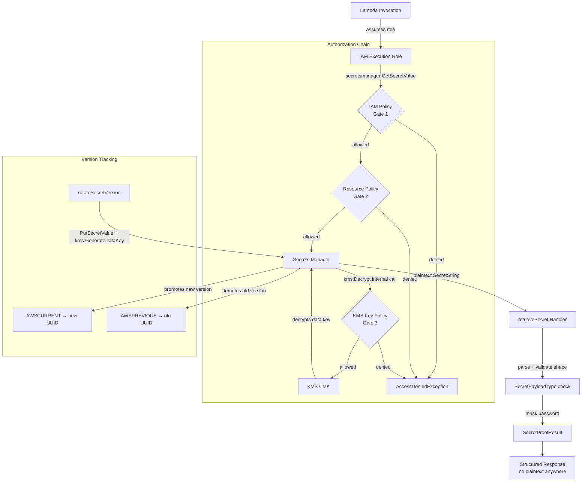

# Lab-06 Secrets Manager + KMS | **README**


`#DevAssociateLab` &nbsp;|&nbsp; `AWS DVA-C02` &nbsp;|&nbsp; `Secrets Manager` &nbsp;|&nbsp; `KMS` &nbsp;|&nbsp; `Lambda` &nbsp;|&nbsp; `TypeScript` &nbsp;|&nbsp; `Node 20`

---

## Overview

A production-shaped secrets retrieval workflow demonstrating how AWS Secrets Manager and KMS work together — including the three-layer authorization model, customer-managed key (CMK) creation, secret versioning with staging labels, and a deliberate negative test proving the KMS key policy dependency is real.

---

## What This Demonstrates

### Engineering Behavior

- **Secrets are never logged or returned in plaintext.** The `retrieveSecret` handler constructs a masked proof payload (`appuser / *******************`) instead of exposing the raw value — a non-negotiable production pattern that most tutorials skip entirely.
- **Template files use `${PLACEHOLDER}` syntax — real values never touch the codebase.** All policy JSON files are committed as templates. `envsubst` substitutes live shell variables at runtime and pipes directly to the AWS CLI via `file:///dev/stdin`. No sensitive values are ever written to disk or committed to git.
- **Environment is loaded explicitly at session start.** All derived values (ARNs, region, account ID) live in a gitignored `.env.lab06` file and are sourced at the start of every terminal session. This eliminates the most common lab failure mode: stale or empty variables causing silent wrong-region deployments.
- **Dependencies are proven before they're wired together.** KMS key is created and verified before the IAM policy references its ARN. The secret is verified to use the CMK before Lambda is deployed. Each layer is confirmed before the next layer depends on it.
- **All three authorization layers are explicitly configured.** IAM identity policy, Secrets Manager resource policy, and KMS key policy are each deliberately set — not left to defaults. The resource policy adds belt-and-suspenders scoping on top of IAM.
- **Negative testing is deliberate evidence.** The KMS `Decrypt` denial test doesn't just run the happy path — it proves the authorization chain is real by intentionally breaking it, capturing the failure, then restoring access and capturing the recovery. That's how you prove a security control actually works.
- **`kms:GenerateDataKey` is included alongside `kms:Decrypt`.** Reading secrets only needs `Decrypt`. Writing new versions (rotation) needs `GenerateDataKey`. Both are required for a complete Secrets Manager workflow — omitting `GenerateDataKey` is the most common rotation failure.

### Core AWS Concepts

- **KMS envelope encryption** — Secrets Manager does not store your plaintext secret. It generates a data key via KMS (`GenerateDataKey`), encrypts the secret with that data key, and stores the encrypted blob. On `GetSecretValue`, KMS decrypts the data key (`Decrypt`) and Secrets Manager uses it to decrypt the secret — you never handle raw encryption.
- **Three-layer authorization model** — Every `GetSecretValue` call is gated by three independent policies evaluated in sequence: (1) IAM identity policy on the caller's role, (2) Secrets Manager resource policy on the secret, (3) KMS key policy on the CMK. All three must allow the action. A `Deny` at any layer terminates the call regardless of `Allow` statements elsewhere.
- **KMS key policy is evaluated independently from IAM** — IAM granting `kms:Decrypt` is necessary but not sufficient. KMS checks its own key policy independently and will deny the call if the principal is not listed — even if IAM explicitly allows it. This is the #1 authorization debugging trap in this service combination.
- **Customer-managed key (CMK) vs AWS-managed key** — The default `aws/secretsmanager` key is managed by AWS; you cannot modify its key policy or grant cross-account access. A CMK gives you full control: scope decrypt to specific principals, enable cross-account access, and audit every decrypt operation via CloudTrail.
- **Secrets Manager resource policy** — An optional resource-based policy attached directly to the secret (analogous to an S3 bucket policy). Evaluated alongside IAM. A `Deny` in the resource policy overrides any `Allow` in IAM. Required for cross-account access. Used here for same-account belt-and-suspenders scoping.
- **Secret versioning and staging labels** — Secrets Manager maintains a version history. `AWSCURRENT` = active version. `AWSPREVIOUS` = version before last update. `AWSPENDING` = in-flight during rotation only. `GetSecretValue` defaults to `AWSCURRENT` — `AWSPREVIOUS` must be requested explicitly. Only one version per label at any time.
- **`kms:GenerateDataKey` for write operations** — Reading a secret calls `kms:Decrypt`. Writing a new secret version calls `kms:GenerateDataKey` to encrypt the new value. Both must be granted in the IAM policy and KMS key policy for a full read/write workflow.
- **IAM least-privilege scoping** — `secretsmanager:GetSecretValue` scoped to `${LAB}/*` ARN path (not `*`). KMS permissions scoped to the specific CMK ARN. Neither permission is broader than what the function needs.

---

## Architecture



---

## Services Used

| Service | Role in lab |
|---|---|
| **AWS Secrets Manager** | Stores the CMK-encrypted secret; manages versioning and staging labels; evaluates resource policy |
| **AWS KMS** | Provides the CMK for envelope encryption; evaluates key policy independently on every Decrypt and GenerateDataKey call |
| **AWS Lambda** | Retrieves and validates the secret (retrieveSecret); manually rotates the version (rotateSecretVersion) |
| **AWS IAM** | Execution role with least-privilege permissions scoped to specific secret ARN path and CMK ARN |
| **Amazon CloudWatch Logs** | Captures Lambda invocation logs — no plaintext secret values appear |

---

## Repo Structure

```
lab-06-secrets-manager-kms/
├── README.md
├── .env.lab06              ← gitignored — never commit
├── .env.lab06.example      ← committed — placeholder values with comments
├── .gitignore
├── package.json
├── tsconfig.json
├── src/
│   ├── handlers/
│   │   ├── retrieveSecret.ts       ← core proof handler
│   │   └── rotateSecretVersion.ts  ← version bump + label tracking
│   └── shared/
│       ├── types.ts                ← SecretPayload, SecretProofResult, inputs
│       └── errors.ts               ← SecretRetrievalError, SecretValidationError
├── infra/
│   ├── iam/
│   │   ├── lambda-trust.json
│   │   └── lambda-secrets-kms-policy.json   ← template with ${PLACEHOLDERS}
│   ├── kms/
│   │   └── key-policy.json                  ← template with ${PLACEHOLDERS}
│   └── secretsmanager/
│       └── resource-policy.json             ← template with ${PLACEHOLDERS}
└── docs/
    └── screenshots/
```

---

## Prerequisites

- AWS CLI configured with a named profile
- Node 20+ / npm installed
- `envsubst` available (built into macOS and Linux)

---

## How to Deploy (CLI-first Runbook)

### 0) Environment setup

```bash
# Create .env.lab06 from the example file and populate your values
cp .env.lab06.example .env.lab06

# Load at the start of every terminal session
set -a && source ./.env.lab06 && set +a

# Verify
echo "$AWS_PROFILE" && echo "$AWS_REGION" && echo "$ACCOUNT_ID"
aws sts get-caller-identity --profile "$AWS_PROFILE"
```

> **macOS region note:** Set `AWS_DEFAULT_REGION` in `.env.lab06` to override the CLI profile region. Verify with `aws configure get region --profile "$AWS_PROFILE"` before creating resources.

✅ Pass: correct account + region.

---

### 1) Build TypeScript → dist

```bash
npm run clean && npm run build
find dist -maxdepth 3 -type f -print
sed -n '1,3p' dist/handlers/retrieveSecret.js  # confirms "use strict" / CommonJS
```

✅ Pass: `dist/handlers/*.js` and `dist/shared/*.js` exist. Output starts with `"use strict"`.

---

### 2) Package Lambda zip

```bash
cd dist && zip -r ../lambda.zip . && cd ..
zipinfo -1 lambda.zip
ls -lah lambda.zip
```

✅ Pass: zip contains `handlers/retrieveSecret.js`, `handlers/rotateSecretVersion.js`, `shared/*.js` — all at root level, no `dist/` prefix.

---

### 3) IAM — Lambda execution role

```bash
aws iam create-role \
  --profile "$AWS_PROFILE" \
  --role-name "${LAB}-lambda-exec" \
  --assume-role-policy-document file://infra/iam/lambda-trust.json

aws iam attach-role-policy \
  --profile "$AWS_PROFILE" \
  --role-name "${LAB}-lambda-exec" \
  --policy-arn arn:aws:iam::aws:policy/service-role/AWSLambdaBasicExecutionRole

export LAMBDA_ROLE_ARN="$(aws iam get-role \
  --profile "$AWS_PROFILE" \
  --role-name "${LAB}-lambda-exec" \
  --query Role.Arn --output text)"

echo "$LAMBDA_ROLE_ARN"
echo "LAMBDA_ROLE_ARN=$LAMBDA_ROLE_ARN" >> .env.lab06
```

✅ Pass: `LAMBDA_ROLE_ARN` prints.

---

### 4) KMS — Create customer-managed key

```bash
export KMS_KEY_ARN="$(envsubst < infra/kms/key-policy.json | \
  aws kms create-key \
    --profile "$AWS_PROFILE" \
    --description "Lab06 CMK for Secrets Manager" \
    --key-usage ENCRYPT_DECRYPT \
    --key-spec SYMMETRIC_DEFAULT \
    --policy file:///dev/stdin \
    --query KeyMetadata.Arn \
    --output text)"

echo "$KMS_KEY_ARN"
echo "KMS_KEY_ARN=$KMS_KEY_ARN" >> .env.lab06

aws kms create-alias \
  --profile "$AWS_PROFILE" \
  --alias-name "alias/${LAB}-secret-key" \
  --target-key-id "$KMS_KEY_ARN"
```

✅ Pass: ARN contains your intended region. Alias created with no error.

---

### 5) IAM — Create + attach Secrets Manager + KMS policy

```bash
export SECRETS_KMS_POLICY_ARN="$(envsubst < infra/iam/lambda-secrets-kms-policy.json | \
  aws iam create-policy \
    --profile "$AWS_PROFILE" \
    --policy-name "${LAB}-lambda-secrets-kms" \
    --policy-document file:///dev/stdin \
    --query Policy.Arn \
    --output text)"

aws iam attach-role-policy \
  --profile "$AWS_PROFILE" \
  --role-name "${LAB}-lambda-exec" \
  --policy-arn "$SECRETS_KMS_POLICY_ARN"

echo "$SECRETS_KMS_POLICY_ARN"
echo "SECRETS_KMS_POLICY_ARN=$SECRETS_KMS_POLICY_ARN" >> .env.lab06

aws iam list-attached-role-policies \
  --profile "$AWS_PROFILE" \
  --role-name "${LAB}-lambda-exec" \
  --output table
```

✅ Pass: Table shows `AWSLambdaBasicExecutionRole` and `lab06-secrets-kms-lambda-secrets-kms`.

---

### 6) Secrets Manager — Create secret backed by CMK

```bash
export SECRET_NAME="${LAB}/app-credentials"

export SECRET_ARN="$(aws secretsmanager create-secret \
  --profile "$AWS_PROFILE" \
  --name "$SECRET_NAME" \
  --description "Lab 06 app credentials encrypted with CMK" \
  --kms-key-id "$KMS_KEY_ARN" \
  --secret-string '{"username":"appuser","password":"initial-password-v1","environment":"lab06"}' \
  --query ARN --output text)"

echo "$SECRET_ARN"
echo "SECRET_ARN=$SECRET_ARN" >> .env.lab06

aws secretsmanager describe-secret \
  --profile "$AWS_PROFILE" \
  --secret-id "$SECRET_NAME" \
  --query '{Name:Name,KmsKeyId:KmsKeyId,ARN:ARN}' \
  --output table
```

✅ Pass: `KmsKeyId` shows your CMK ARN — not `aws/secretsmanager`. Region matches.

---

### 7) Secrets Manager — Attach resource policy

```bash
envsubst < infra/secretsmanager/resource-policy.json | \
  aws secretsmanager put-resource-policy \
    --profile "$AWS_PROFILE" \
    --secret-id "$SECRET_NAME" \
    --resource-policy file:///dev/stdin \
    --block-public-policy

aws secretsmanager get-resource-policy \
  --profile "$AWS_PROFILE" \
  --secret-id "$SECRET_NAME" \
  --query 'ResourcePolicy' \
  --output text | python3 -m json.tool
```

✅ Pass: Policy shows `LAMBDA_ROLE_ARN` as principal. No `${}` placeholders.

---

### 8) Lambda — Create functions

```bash
export FN_RETRIEVE="${LAB}-retrieveSecret"
export FN_ROTATE="${LAB}-rotateSecretVersion"

aws lambda create-function \
  --profile "$AWS_PROFILE" \
  --function-name "$FN_RETRIEVE" \
  --runtime nodejs20.x \
  --role "$LAMBDA_ROLE_ARN" \
  --handler "handlers/retrieveSecret.handler" \
  --zip-file "fileb://lambda.zip" \
  --environment "Variables={SECRET_NAME=${SECRET_NAME}}" \
  --timeout 10

aws lambda create-function \
  --profile "$AWS_PROFILE" \
  --function-name "$FN_ROTATE" \
  --runtime nodejs20.x \
  --role "$LAMBDA_ROLE_ARN" \
  --handler "handlers/rotateSecretVersion.handler" \
  --zip-file "fileb://lambda.zip" \
  --environment "Variables={SECRET_NAME=${SECRET_NAME}}" \
  --timeout 10

aws iam put-role-policy \
  --profile "$AWS_PROFILE" \
  --role-name "${LAB}-lambda-exec" \
  --policy-name "allow-put-secret-value" \
  --policy-document "{
    \"Version\": \"2012-10-17\",
    \"Statement\": [{
      \"Effect\": \"Allow\",
      \"Action\": [\"secretsmanager:PutSecretValue\",\"secretsmanager:DescribeSecret\"],
      \"Resource\": \"${SECRET_ARN}\"
    }]
  }"

aws lambda get-function-configuration \
  --profile "$AWS_PROFILE" \
  --function-name "$FN_RETRIEVE" \
  --query '{Runtime:Runtime,Handler:Handler,Role:Role,Timeout:Timeout}' \
  --output table
```

✅ Pass: Runtime `nodejs20.x`, Handler `handlers/retrieveSecret.handler`, Timeout `10`.

---

## How to Test

### The Four-Invocation Sequence

```bash
# Invoke 1 — Retrieve AWSCURRENT (initial version)
aws lambda invoke --profile "$AWS_PROFILE" \
  --function-name "$FN_RETRIEVE" \
  --cli-binary-format raw-in-base64-out \
  --payload '{"versionStage":"AWSCURRENT"}' out-retrieve-current.json
cat out-retrieve-current.json | jq .

# Invoke 2 — Rotate (creates new version, shifts labels)
aws lambda invoke --profile "$AWS_PROFILE" \
  --function-name "$FN_ROTATE" \
  --cli-binary-format raw-in-base64-out \
  --payload '{"newPassword":"rotated-password-v2"}' out-rotate.json
cat out-rotate.json | jq .

# Invoke 3 — Retrieve AWSPREVIOUS (proves old version still accessible)
aws lambda invoke --profile "$AWS_PROFILE" \
  --function-name "$FN_RETRIEVE" \
  --cli-binary-format raw-in-base64-out \
  --payload '{"versionStage":"AWSPREVIOUS"}' out-retrieve-previous.json
cat out-retrieve-previous.json | jq .

# Invoke 4 — Retrieve AWSCURRENT (proves label now points to new version)
aws lambda invoke --profile "$AWS_PROFILE" \
  --function-name "$FN_RETRIEVE" \
  --cli-binary-format raw-in-base64-out \
  --payload '{"versionStage":"AWSCURRENT"}' out-retrieve-current.json
cat out-retrieve-current.json | jq .
```

### Version diff proof

```bash
echo "=== AWSCURRENT ===" && cat out-retrieve-current.json | \
  python3 -c "import sys,json; d=json.load(sys.stdin); print('versionId:', d['versionId'])"
echo "=== AWSPREVIOUS ===" && cat out-retrieve-previous.json | \
  python3 -c "import sys,json; d=json.load(sys.stdin); print('versionId:', d['versionId'])"
```

### Negative test — KMS dependency proof

```bash
# Add Deny
aws iam put-role-policy --profile "$AWS_PROFILE" \
  --role-name "${LAB}-lambda-exec" \
  --policy-name "allow-kms-decrypt-disabled" \
  --policy-document "{\"Version\":\"2012-10-17\",\"Statement\":[{\"Effect\":\"Deny\",\"Action\":\"kms:Decrypt\",\"Resource\":\"${KMS_KEY_ARN}\"}]}"

# Invoke — expect AccessDeniedException
aws lambda invoke --profile "$AWS_PROFILE" \
  --function-name "$FN_RETRIEVE" \
  --cli-binary-format raw-in-base64-out \
  --payload '{"versionStage":"AWSCURRENT"}' out-retrieve-denied.json
cat out-retrieve-denied.json | jq .

# Remove Deny
aws iam delete-role-policy --profile "$AWS_PROFILE" \
  --role-name "${LAB}-lambda-exec" --policy-name "allow-kms-decrypt-disabled"

# Invoke — expect valid: true
aws lambda invoke --profile "$AWS_PROFILE" \
  --function-name "$FN_RETRIEVE" \
  --cli-binary-format raw-in-base64-out \
  --payload '{"versionStage":"AWSCURRENT"}' out-retrieve-restored.json
cat out-retrieve-restored.json | jq .
```

---

## DVA-C02 Exam Cues

### The Three-Layer Authorization Model

```
Layer 1 — IAM identity policy (on the role)
    secretsmanager:GetSecretValue  ← must Allow
    kms:Decrypt                    ← must Allow
    kms:GenerateDataKey            ← must Allow (for write operations)

Layer 2 — Secrets Manager resource policy (on the secret)
    must not Deny the caller
    if absent: no effect
    if present with Allow: reinforces access
    if present with Deny: blocks caller regardless of IAM

Layer 3 — KMS key policy (on the CMK)
    must list the principal and Allow kms:Decrypt
    evaluated independently — IAM alone is not sufficient
```

### CMK vs AWS-Managed Key

| | AWS-managed | CMK |
|---|---|---|
| Key policy control | AWS — unmodifiable | You — full control |
| Cross-account access | ❌ Not supported | ✅ Via key policy Principal |
| Specific principal decrypt | ❌ Not possible | ✅ Scope by ARN |
| CloudTrail per-caller audit | Limited | ✅ Every Decrypt logged |
| Cost | Free | ~$1/month |

### Staging Labels

| Label | Meaning | Requires explicit request? |
|---|---|---|
| `AWSCURRENT` | Active version | ❌ Default |
| `AWSPREVIOUS` | Before last rotation/update | ✅ Yes |
| `AWSPENDING` | In-flight rotation only | ✅ Yes — rarely needed |

### Critical Exam Points

- `GetSecretValue` **always** calls KMS Decrypt — there is no "get encrypted" API
- KMS key policy is evaluated **independently** from IAM — both must Allow
- Resource policy `Deny` overrides any IAM `Allow` — no exceptions
- `kms:GenerateDataKey` is required for write operations — `kms:Decrypt` alone is read-only
- Cross-account Secrets Manager access requires a resource policy on the secret — IAM alone is insufficient

---

## Interview Talking Points

**On the authorization model:**
> The thing most people miss with Secrets Manager is that it's a three-gate system — IAM, resource policy, and KMS key policy all evaluated independently. I proved this with a negative test: I denied `kms:Decrypt` at the IAM level and showed the `AccessDeniedException`. Then I restored it and showed the successful retrieval. That's how you prove a security control is actually doing something.

**On CMK choice:**
> I used a customer-managed key specifically because it lets me scope the key policy to the Lambda execution role ARN. With the AWS-managed key, you can't do that — anyone with `GetSecretValue` in IAM can decrypt. CMK gives you the additional authorization layer that compliance actually requires.

**On `kms:GenerateDataKey`:**
> A common mistake is granting only `kms:Decrypt` — that's sufficient for reads but breaks the moment you try to write a new secret version. Rotation calls `PutSecretValue`, which needs `kms:GenerateDataKey` to encrypt the new value. I caught this during the lab when the rotate handler failed with `AccessDeniedException` and added the missing permission to both the IAM policy and the key policy.

**On secret versioning:**
> Secrets Manager keeps the last two versions labeled AWSCURRENT and AWSPREVIOUS. I demonstrated this by rotating the secret and then retrieving both versions, comparing the version IDs. In production, this is how zero-downtime rotation works — the new credentials become AWSCURRENT while the old ones stay accessible via AWSPREVIOUS until all consumers have updated.

---

## Evidence Screenshots

| # | Description | Filename |
|---|---|---|
| 01 | TypeScript build baseline — `npm run build` + `dist/` files confirmed | `01-ts-build-baseline.png` |
| 02 | IAM Lambda execution role — console role summary | `02-iam-lambda-exec-role.png` |
| 03 | IAM Lambda exec role — permissions tab, both policies attached | `03-iam-lambda-exec-role-permissions-attached.png` |
| 04 | IAM Lambda exec role — trust relationships tab (`lambda.amazonaws.com`) | `04-iam-lambda-exec-role-trust-relationship.png` |
| 05 | IAM Secrets + KMS policy JSON — scoped ARNs, three KMS actions visible | `05-iam-secrets-kms-policy.png` |
| 05b | Secrets Manager resource policy — console showing Lambda role ARN as principal | `05b-secretsmanager-resource-policy.png` |
| 06 | Secret created — `describe-secret` output showing CMK ARN in KmsKeyId | `06-secret-created.png` |
| 07 | Lambda zip built — `zipinfo` + `ls -lah` showing handler paths at root | `07-lambda-zip-built.png` |
| 08 | Lambda functions created — AWS console list showing both functions | `08-lambda-functions-created.png` |
| 09 | Lambda handler + runtime proof — `get-function-configuration` table | `09-lambda-handler-runtime-proof.png` |
| 10 | Full invoke sequence — all four invocations annotated showing the staging label chain | `10-lambda-functions-invoke-and-sequence-chain-proof.png` |
| 11 | KMS access denied proof — negative test: Deny added → fail → Deny removed → success | `11-kms-access-denied-proof.png` |

---

## Teardown

```bash
aws lambda delete-function --profile "$AWS_PROFILE" --function-name "$FN_RETRIEVE"
aws lambda delete-function --profile "$AWS_PROFILE" --function-name "$FN_ROTATE"

aws secretsmanager delete-secret --profile "$AWS_PROFILE" \
  --secret-id "$SECRET_NAME" --force-delete-without-recovery

# KMS — 7-day minimum waiting period
aws kms schedule-key-deletion --profile "$AWS_PROFILE" \
  --key-id "$KMS_KEY_ARN" --pending-window-in-days 7

aws iam delete-role-policy --profile "$AWS_PROFILE" \
  --role-name "${LAB}-lambda-exec" --policy-name "allow-put-secret-value"

aws iam detach-role-policy --profile "$AWS_PROFILE" \
  --role-name "${LAB}-lambda-exec" --policy-arn "$SECRETS_KMS_POLICY_ARN"

aws iam detach-role-policy --profile "$AWS_PROFILE" \
  --role-name "${LAB}-lambda-exec" \
  --policy-arn arn:aws:iam::aws:policy/service-role/AWSLambdaBasicExecutionRole

aws iam delete-policy --profile "$AWS_PROFILE" --policy-arn "$SECRETS_KMS_POLICY_ARN"
aws iam delete-role --profile "$AWS_PROFILE" --role-name "${LAB}-lambda-exec"
```

> **KMS note:** `schedule-key-deletion` disables the key immediately. Cancel with `aws kms cancel-key-deletion --key-id $KMS_KEY_ARN` before the window expires if needed.

---

*Lab series: [aws-labs](https://github.com/yourusername/aws-labs) — DVA-C02 aligned portfolio projects*
